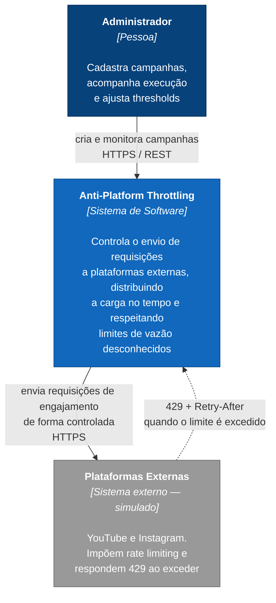
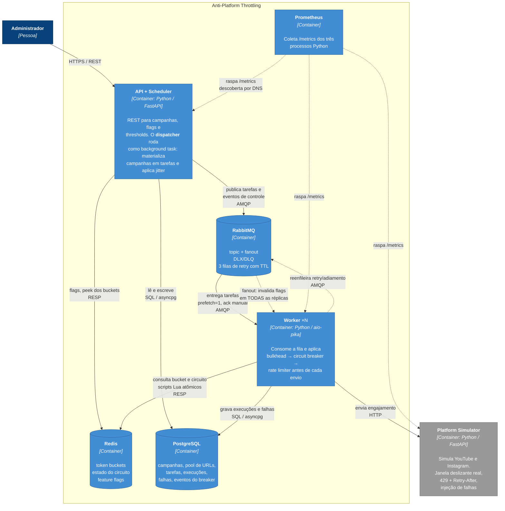
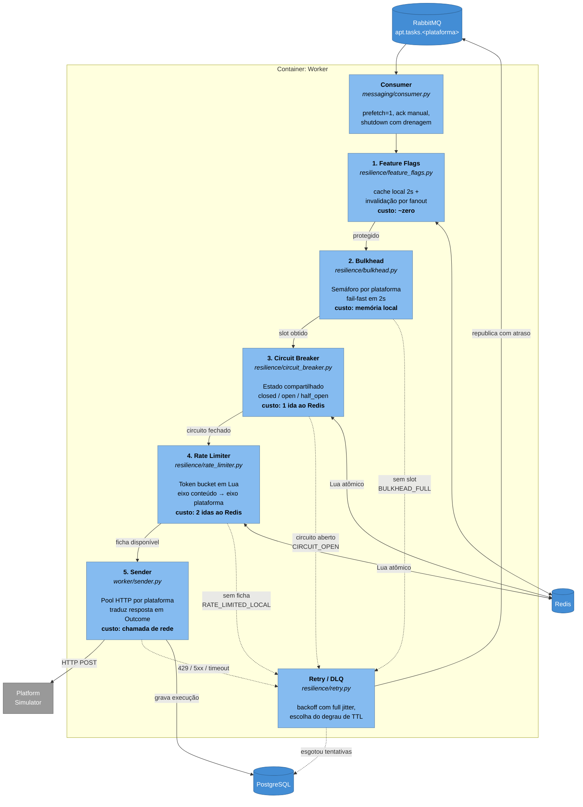
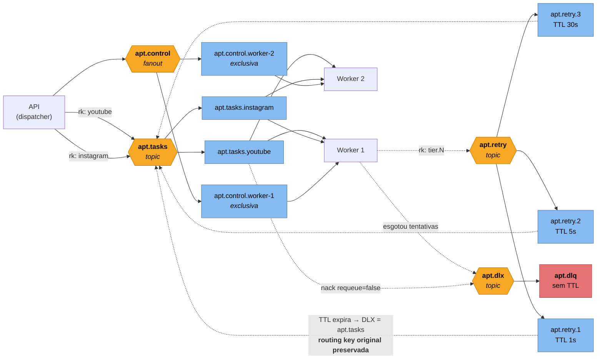
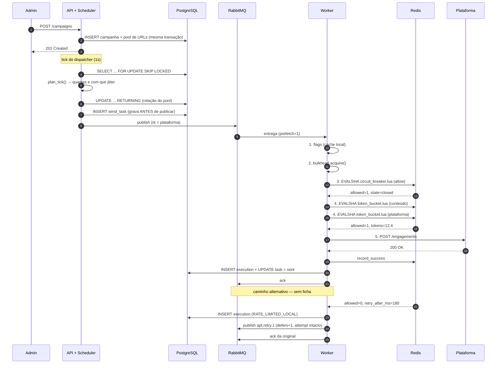

# Arquitetura — Anti-Platform Throttling

Diagramas C4 nos níveis **1 (Contexto)**, **2 (Containers)** e **3 (Componentes)**.
O documento da disciplina exige os níveis 1 e 2; o nível 3 foi incluído porque é
onde o mecanismo central da POC fica visível.

> **Mudanças em relação ao Projeto 02.** Os diagramas do Projeto 02 previam 4
> containers (API, RabbitMQ, Worker, PostgreSQL). Esta entrega tem 7: entraram
> **Redis** (ADR-003, o estado distribuído que faltava), **Platform Simulator**
> (ADR-008) e **Prometheus**. O scheduler que apareceu durante a implementação foi
> absorvido pela API (ADR-010). Justificativa completa em
> [ATUALIZACOES-DOC-INICIAL.md](ATUALIZACOES-DOC-INICIAL.md).

---

## Nível 1 — Contexto



**O problema.** Plataformas externas impõem limites de utilização que **não são
publicados** e mudam sem aviso. Exceder esses limites causa throttling e, na
reincidência, penalização algorítmica — e cada requisição enviada *durante* a
penalidade tende a estendê-la.

**A responsabilidade do sistema.** Distribuir a carga ao longo do tempo, manter a
vazão abaixo de um limite estimado com margem de segurança, e reagir a falhas sem
agravá-las.

**O que está fora.** O sistema não descobre os limites reais das plataformas — ver
[ADR-008](adr/ADR-008-simulador-de-plataformas.md) para a discussão dessa fronteira
e o porquê de ela existir.

---

## Nível 2 — Containers



### Responsabilidade de cada container

| Container | Tecnologia | Responsabilidade | Escala |
|---|---|---|---|
| **API + Scheduler** | FastAPI, uvicorn | REST de campanhas/flags/thresholds; o dispatcher materializa campanhas em tarefas com jitter | horizontal (`SKIP LOCKED` evita duplicidade — [ADR-010](adr/ADR-010-scheduler-na-api.md)) |
| **Worker** | aio-pika, httpx | Aplica as 5 camadas de proteção e envia | **horizontal — é a demo central** |
| **RabbitMQ** | 3.13 | Desacopla recebimento de processamento; DLQ; backoff via TTL | single-node na POC |
| **Redis** | 7 | Estado **compartilhado** dos mecanismos distribuídos | single-node na POC |
| **PostgreSQL** | 16 | Persistência e a base das métricas de teste | single-node na POC |
| **Platform Simulator** | FastAPI | Dublê das plataformas com 429 real | 1 instância |
| **Prometheus** | 2.55 | Coleta de métricas | 1 instância |

### Por que o Redis é indispensável

É a decisão que separa um sistema que funciona de um que falha ao escalar:

```
Rate limiter EM MEMÓRIA DE PROCESSO:
  1 worker  × 16 req/s =  16 req/s   ✓  dentro do limite
  5 workers × 16 req/s =  80 req/s   ✗  4× o limite da plataforma

Rate limiter COM ESTADO NO REDIS:
  1 worker  →  16 req/s   ✓
  5 workers →  16 req/s   ✓  o limite é GLOBAL
```

O bug da primeira versão só apareceria **ao escalar** — sob carga, quando o limite
mais importa, e nunca em desenvolvimento com um worker.

---

## Nível 3 — Componentes do Worker

O nível 3 do worker é onde a POC realmente acontece: as cinco camadas de proteção e a
ordem entre elas.



### A ordem das camadas não é arbitrária

Cada camada é **mais barata que a seguinte**, e recusar cedo evita gastar o recurso da
próxima:

| # | Camada | Custo | Por que nesta posição |
|---|---|---|---|
| 1 | Feature Flags | cache local | Se a proteção está desligada, nem consultamos o resto |
| 2 | Bulkhead | semáforo em memória | Sem slot de execução, nada mais faz sentido |
| 3 | Circuit Breaker | 1 ida ao Redis | Se a plataforma está fora, **não gaste ficha do bucket** |
| 4 | Rate Limiter | 2 idas ao Redis | A decisão mais cara antes do envio |
| 5 | Envio | chamada de rede | A operação mais cara |

**O detalhe que mais importa nessa ordem:** o breaker vem **antes** do rate limiter.
Consumir uma ficha do bucket para depois descobrir que o circuito está aberto
desperdiçaria cota — e **a ficha não volta**. Invertendo, o circuito filtra primeiro e
o bucket só é tocado quando o envio tem chance real de acontecer.

Dentro do rate limiter, a mesma lógica se repete: o eixo do **conteúdo** (mais
restritivo) é consultado antes do eixo da **plataforma**. Fazer o inverso vazaria
fichas da cota global em requisições que o eixo do conteúdo negaria em seguida.

### Adiamento não é falha

Os quatro caminhos pontilhados para `Retry / DLQ` parecem iguais no diagrama e são
tratados de forma **diferente**:

| Origem | `Outcome` | Conta como? | Contador |
|---|---|---|---|
| Bulkhead cheio | `BULKHEAD_FULL` | adiamento nosso | `defers` |
| Circuito aberto | `CIRCUIT_OPEN` | adiamento nosso | `defers` |
| Sem ficha | `RATE_LIMITED_LOCAL` | adiamento nosso | `defers` |
| 429 / 5xx / timeout | `THROTTLED` / `ERROR` / `TIMEOUT` | **rejeição da plataforma** | `attempt` |

Só as rejeições da plataforma alimentam o circuit breaker e consomem tentativa. Se os
adiamentos contassem, **o rate limiter abriria o circuito ao fazer o seu trabalho** e
tarefas legítimas iriam para a DLQ sem nunca ter sido enviadas. Ver
[ADR-006](adr/ADR-006-circuit-breaker-distribuido.md) e
[ADR-009](adr/ADR-009-retry-com-filas-ttl.md).

---

## Topologia do RabbitMQ



### Três decisões visíveis neste diagrama

**Uma fila por plataforma** — é a camada estrutural do Bulkhead. Mil tarefas de
Instagram acumuladas não ficam à frente das de YouTube, porque estão em outra fila.

**Fanout com fila privada por worker** — com um exchange *topic* e fila compartilhada,
uma invalidação de feature flag chegaria a **um** worker; os outros ficariam com cache
velho. Fanout garante que todos recebem.

**As filas de retry não definem `x-dead-letter-routing-key`** — é isso que faz o
RabbitMQ **preservar a routing key original** (a plataforma) quando o TTL expira e a
mensagem volta. Definir essa chave mandaria todo retry para a fila errada, e o bug
seria silencioso: as mensagens circulariam sem nunca chegar ao consumidor certo.

---

## Fluxo de um envio, de ponta a ponta



**Observação sobre os passos 4–5.** As duas consultas ao Redis no passo 4 são
`EVALSHA` de scripts Lua, e é aí que a atomicidade acontece. Com
`GET` → decide → `SET`, cinco workers poderiam ler "resta 1 ficha" ao mesmo tempo e
cinco requisições sairiam. Ver
[ADR-005](adr/ADR-005-script-lua-para-atomicidade.md).

**Observação sobre a ordem "grava antes de publicar".** Se a publicação falhar, sobra
uma linha `pending` em `send_tasks` — uma tarefa órfã **visível e auditável**. Na ordem
inversa, o worker receberia uma mensagem cujo `task_id` não existe, e o envio
aconteceria sem registro. Registro sem envio é melhor que envio sem registro.

---

## Documentos relacionados

| Documento | Conteúdo |
|---|---|
| [PADROES.md](PADROES.md) | Os 6 padrões: onde estão no código e como demonstrar |
| [adr/](adr/) | 12 ADRs com as decisões e alternativas rejeitadas |
| [TRADE-OFFS.md](TRADE-OFFS.md) | O custo assumido de cada decisão |
| [CODIGO-EXPLICADO.md](CODIGO-EXPLICADO.md) | Arquivo por arquivo + Q&A antecipado |
| [PLANO-DE-TESTES.md](PLANO-DE-TESTES.md) | Cenários e critérios de aceite |
| [RESULTADOS-TESTES.md](RESULTADOS-TESTES.md) | Números medidos |
| [ATUALIZACOES-DOC-INICIAL.md](ATUALIZACOES-DOC-INICIAL.md) | O que mudou desde o Projeto 02 e por quê |
